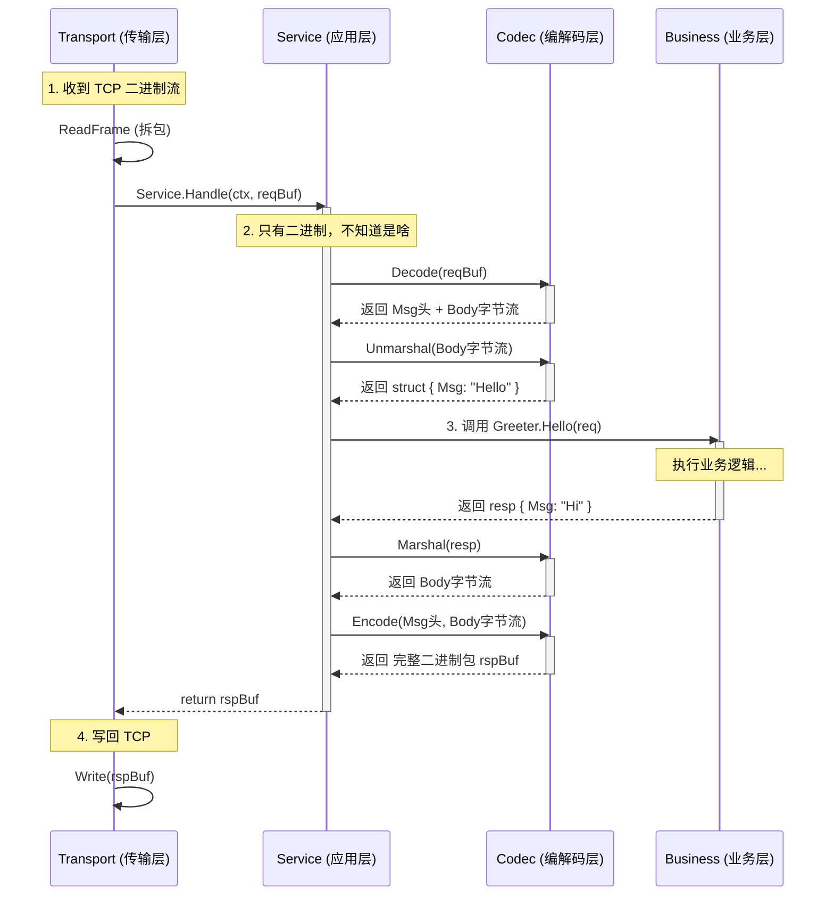

# trpc-go

# 前言 与 AI RoadMap

trpc-go 是一个基于 Go 语言的 **RPC 框架**，它的设计目标是提供一个高性能、高并发的 RPC 框架，同时也提供了一些常用的功能，如服务注册与发现、负载均衡、断路器、网关等。

## RPC框架 与 Web框架

如果你熟悉 Gin 或 SpringBoot，可能会惊讶于 trpc-go 对底层（如 Transport/Codec）的暴露程度。这是设计目标决定的：

| 维度 | Web 框架 (Gin, SpringBoot) | RPC 框架 (trpc-go, gRPC) |
| :--- | :--- | :--- |
| **核心协议** | **HTTP** (强绑定) | **多协议** (TCP/UDP, tRPC/gRPC/HTTP) |
| **底层控制** | 黑盒 (依赖 Tomcat/net/http) | **白盒** (自研 Transport/Framer) |
| **目标** | 通用性、开发效率 | **极致性能**、海量并发、服务治理 |

---

- **web框架**: "给我一个 HTTP 请求，我帮你路由到 Controller。"
- **rpc框架**: "不管你是 TCP 还是 UDP，不管你是 PB 还是 JSON，我都给你拆解好，送到你的 Service 方法里，顺便把超时、熔断、监控都给你做了。"

--- 

## AI RoadMap

- ai copilot prompt
```text
这是由腾讯开源的rpc框架的go语言版本trpc-go，<引用项目>，其README为<引用README中英文版本>，请你仔细阅读其说明文档和项目结构，并确保自己能掌握它。

我是一名正在学习trpc-go的新手，我有着一定的go基础和单体web开发基础(gin,springboot),有一定的分布式微服务基础(了解微服务架构,服务注册与发现,负载均衡,断路器,网关等概念但并不熟悉)。我后续的工作需要使用trpc-go框架，故我希望较为深入地学习它，不局限于如何使用，更希望能从其设计原理和实现机制中受益。

请你根据目前的情况，为我梳理我应该从哪里开始熟悉trpc-go的各个模块，并开始这个模块的实践和源码阅读。
```

- Roadmap from ai
```markdown
### 核心建议：从哪里开始？

**第一站：`examples/helloworld` + `server` 核心流程**

这是理解 RPC 框架“骨架”的最佳起点。虽然 Hello World 很简单，但我们要用“源码阅读”的视角去打开它。

#### 1. 实践任务 (Practice)
首先，请确保你能跑通官方示例。这不仅仅是运行，而是为了建立对 `trpc_go.yaml` 配置文件的感性认识（类似于 SpringBoot 的 `application.yml`）。

你可以尝试以下操作（我会稍后为你展示如何通过命令执行）：
1.  进入 `examples/helloworld`。
2.  运行 Server。
3.  运行 Client 进行调用。
4.  **进阶尝试**：修改 `trpc_go.yaml` 中的端口，或者尝试增加一个简单的中间件（Filter）。

#### 2. 源码阅读重点 (Source Code Focus)
在跑通 Demo 后，不要停留在生成的 `.pb.go` 代码上，而是深入框架核心。请按以下顺序阅读源码：

*   **入口**：`server/server.go`
    *   关注 `NewServer()` 和 `Serve()`。
    *   思考：它是如何启动监听的？它是如何管理多个 Service 的？
*   **注册**：`server/service.go`
    *   关注 `Register()`。
    *   思考：Gin 是通过路由树（Trie Tree）匹配 URL，tRPC 是如何通过 `/package.Service/Method` 找到对应的处理函数的？
*   **配置**：`server/options.go`
    *   `trpc-go` 大量使用了 `Option` 模式（Go 语言经典设计模式），这在你的 Gin 开发中可能见得不多，但在高阶 Go 项目中非常普遍。

---

### 详细学习路径规划

为了让你既能上手又能懂原理，我将学习过程拆分为三个阶段，每个阶段对应特定的目录和知识点：

#### 第一阶段：核心骨架与请求流转 (Current Focus)
**目标**：理解一个 RPC 请求是如何从网络包变成你的函数调用的。
*   **对应目录**：`server/`, `client/`, `codec/`, `examples/helloworld`
*   **关键问题**：
    *   **Codec (编解码)**：数据是如何被序列化（PB/JSON）并打包成二进制流的？(阅读 `codec/codec.go`)
    *   **Transport (传输)**：Client 是如何复用连接的？Server 是如何处理并发请求的？
*   **类比**：
    *   `Codec` 类似于 Spring 的 `HttpMessageConverter`。
    *   `Service` 注册类似于 Gin 的 `router.POST(...)`。

#### 第二阶段：微服务治理 (Microservice Governance)
**目标**：理解分布式系统的核心概念在代码层面的实现。
*   **对应目录**：`naming/` (核心), `filter/`
*   **关键知识点**：
    *   **Service Discovery (服务发现)**：查看 `naming/discovery`。了解它是如何通过接口抽象，支持多种注册中心（如 Consul, ETCD, 北极星）的。
    *   **Load Balance (负载均衡)**：查看 `naming/loadbalance`。看看它是如何实现轮询（RoundRobin）或一致性哈希的。
    *   **Circuit Breaker (熔断)**：查看 `naming/circuitbreaker`。
    *   **Filter (拦截器)**：查看 `filter/filter.go`。这等同于 Gin 的 Middleware，是实现非业务逻辑（鉴权、日志、监控）的关键。

#### 第三阶段：插件化架构与高级特性 (Architecture & Advanced)
**目标**：领悟 `trpc-go` 的设计哲学——“一切皆插件”。
*   **对应目录**：`plugin/`, `admin/`, `transport/`
*   **关键点**：
    *   `trpc-go` 几乎所有组件（包括 Log, Config, Naming, Metrics）都是插件化的。学习它是如何通过 `plugin` 包管理这些扩展的。
    *   `admin/`：管理端口，用于运行时查看服务状态（类似 Spring Boot Actuator）。

```

# 服务端启动

## server 初始化
- `/trpc.go`
```go
// NewServer parses the yaml config file to quickly start the server with multiple services.
// The config file is ./trpc_go.yaml by default and can be set by the flag -conf.
// This method should be called only once.
func NewServer(opt ...server.Option) *server.Server
```
该函数按顺序执行了以下操作：
1. 从配置文件(默认是`./trpc_go.yaml`)加载全局配置。
2. 配置**插件**(即配置文件中的`plugins`段)，并获得插件的关闭回调函数(`closePlugins`)
> 什么是**插件**？实现了`/plugin/plugin.go`下的`Factory`接口都可以叫做插件，仅在服务启动时注册一次
3. 配置**下游客户端**配置(即配置文件中的`client`段)，例如下游服务的地址、超时时间、重试策略等。-- 对应的结构体在`/config.go`中的`ClientConfig`。
4. 修正go对容器内CPU核数的感知，即`maxprocs.Set()`
> - Go 的默认行为 ：Go 运行时（Runtime）默认会根据机器的 物理 CPU 核数 来设置 GOMAXPROCS （决定了有多少个系统线程并行执行 Go 代码）。
> - 容器的谎言 ：在 K8s 或 Docker 中，你可能给容器限制了 2核 （Quota），但容器实际上运行在一台 64核 的宿主机上。
> 所以需要使用这个函数让go以容器CPU核数调度Goroutine
5. **核心**:注册`server`和其下属的各个`service`(即配置文件中的`server.service`段)
> 注意区分`server`和`service`的区别：
> - `Server` (服务器) ：是 **进程级** 的概念。它是一个物理容器，代表这一个 Go 进程。
> - `Service` (服务) ：是 **逻辑级** 的概念。它是一个网络监听实体（IP:Port），代表一组相关功能的集合。  
> **关系：1 个 Server 包含 N 个 Service。**

---
第五步所谓的“注册”，其实包含了两层含义：

- **对象注册 (Internal Registration)** ：`s.AddService` 把创建好的 `Service` 对象存到 `Server.services map` 中。这样当 `Server` 启动（`Serve`）时，它知道要启动哪些监听端口。
- **服务发现注册 (Naming Registration)** ：这在 `Service.Serve()` 时才会发生（延迟注册）。当服务启动监听成功后，它会调用 `s.opts.Registry.Register`，**向外部的注册中心（如北极星）汇报：“嘿，我启动好了，我的 IP 是 x.x.x.x”**。
---

6. 注册第2步获得的关闭插件回调，当`server`关闭时先执行插件关闭的回调
7. 返回`server`，这个`server`已经包含了所有配置好的`service`， *ready to serve*

--- 

## 注册 service

`trpc命令行工具`会生成`pb/helloworld.trpc.go`
```go
// pb/helloworld.trpc.go (简化版)

// 1. 定义了"说明书" (ServiceDesc)
var GreeterServer_ServiceDesc = server.ServiceDesc{
    ServiceName: "trpc.helloworld.Greeter", // 关键信息：服务名
    HandlerType: ((*GreeterService)(nil)),  // 类型校验用
    Methods: []server.Method{
        {
            Name: "/trpc.helloworld.Greeter/Hello", // 关键信息：路由路径
            Func: GreeterService_Hello_Handler,     // 关键信息：怎么调用
        },
    },
}

// 2. 注册函数
func RegisterGreeterService(s server.Service, svr GreeterService) {
    // 调用 server 的 Register 方法，把"说明书"和"你的实现"传进去
    if err := s.Register(&GreeterServer_ServiceDesc, svr); err != nil {
        panic(...)
    }
}
```
所以业务方实现了`GreeterService`接口后，就会调用注册函数将其注册到`server`上
```go
pb.RegisterGreeterService(s, &Greeter{})
```

---

那么 `service` 具体的注册逻辑是什么样的呢，其实非常简单粗暴：遍历所有service并匹配
```go
// server/server.go

func (s *Server) Register(serviceDesc interface{}, serviceImpl interface{}) error {
    // 遍历内部所有的 Service（比如端口8000的，端口9000的）
    for _, srv := range s.services {
        // 让每个 Service 都去尝试注册这个业务实现
        if err := srv.Register(desc, serviceImpl); err != nil {
            return err
        }
    }
    return nil
}
```

所以如果有多个service，则上述方式会全部注册上去
```yaml
server:
  service:
    # Service A: 监听 8000 端口，跑 trpc 协议
    - name: trpc.helloworld.Greeter
      ip: 127.0.0.1
      port: 8000
      protocol: trpc
      
    # Service B: 监听 8080 端口，跑 http 协议
    - name: trpc.helloworld.GreeterHTTP
      ip: 127.0.0.1
      port: 8080
      protocol: http
```
- `Service A` 拿到了 `Greeter` 实现。当 8000 端口收到 tRPC 协议的二进制包，解析出方法名 `Hello` ，它会调用 `Greeter.Hello` 。
- `Service B` 也拿到了 `Greeter` 实现。当 8080 端口收到 HTTP 请求（比如 POST `/trpc.helloworld.Greeter/Hello` ），它也会调用同一个 `Greeter.Hello` 。
如果想避免这种情况，则必须要手动精准为某个`service`注册
```go
func main() {
    s := trpc.NewServer()
    
    // 1. 拿到特定的 Service
    tcpService := s.Service("trpc.helloworld.Greeter")
    
    // 2. 只在这个 Service 上注册
    pb.RegisterGreeterService(tcpService, &Greeter{}) 
    
    // HTTP Service 此时是空的，访问它会报错 404
}
```

---

## server 启动！
```go
if err := s.Serve(); err != nil {
    log.Error(err)
}
```
这个`Serve()`方法是整个服务的启动方法，它会阻塞直到服务关闭
> 这个方法之所以在 `serve_unix.go` 中（而不是 `server.go` ），是因为它涉及到**信号处理 （Signal Handling）**，这在 Unix (Linux/macOS) 和 Windows 上的实现是完全不同的。

--- 

Serve() 的核心职责有三点：

1. 并行启动 ：同时启动所有 Service（监听端口）。
2. 信号监听 ：阻塞主线程，等待操作系统信号（SIGTERM/SIGINT/SIGHUP）。
3. 优雅退出 ：收到信号后，协调所有 Service 安全关闭。

---

### 1. 前置检查与初始化 (41-46行)
```go
defer log.Sync() // 退出前确保日志刷盘
if len(s.services) == 0 {
    panic("service empty") // 如果一个 Service 都没有，启动也没意义
}
s.signalCh = make(chan os.Signal) // 信号通道
```

---

### 2. 并行启动所有 Service (52-63行)
```go
for name, service := range s.services {
    go func(n string, srv Service) {
        if e := srv.Serve(); e != nil {
            // 错误处理...
            s.signalCh <- syscall.SIGTERM // 如果启动失败，发信号自杀
        }
    }(name, service)
}
```
- 并发启动 ： `go func` 确保了即使你有 10 个 Service（比如 TCP 8000, UDP 9000, HTTP 8080），它们是**同时**开始监听的，而不是串行等待。这大大加快了启动速度。
- Fail Fast ：如果任何一个 Service 启动失败（比如端口被占用），它会立即向 `signalCh` 发送 `SIGTERM` 信号，触发整个进程退出。这符合“要么全成功，要么全失败”的原子性原则。

---

### 3. 阻塞等待信号 (64-70行)
```go
signal.Notify(s.signalCh, ...) // 注册要监听的信号
select {
case <-s.closeCh:       // 收到代码层面的 Close 调用
case sig = <-s.signalCh: // 收到操作系统的信号
}
```
- 主 Goroutine 在这里 挂起（Block） 。这是为什么你的 main 函数不会退出的原因。
- 它在等什么？
    - SIGINT (Ctrl+C) / SIGTERM (Kill)：正常退出。
    - SIGSEGV ：段错误（Panic）。
    - SIGUSR2 ： 热重启信号 （Graceful Restart）。

---

### 4. 热重启处理 (73-77行)
```go
if sig == DefaultServerGracefulSIG { // 收到 SIGUSR2
    s.StartNewProcess() // 启动新进程
}
```
这是 `trpc-go` 的高级特性。当你想升级代码但不中断连接时，发送 SIGUSR2 ，父进程会 fork 一个子进程，把监听的 Socket 文件描述符（FD）传给子进程。子进程接管服务，父进程优雅退出。

---

### 5. 优雅退出 (79行)
```go
s.tryClose() // 关闭所有 Service
```
不管是因为什么原因退出，最后都会调用 tryClose 。
这个方法会：
1. 执行 `OnShutdownHooks` （前文说的关闭插件）。
2. 调用每个 `Service` 的 `Close` 方法（等待请求处理完，注销 Naming）。

---

至此，服务端的注册和启动运行就完成了。

---


# 请求流转 与 处理
我们将要探索的是：当客户端发来一段二进制数据时，`Server` 是如何一步步把它变成 `HelloRequest` 对象，并最终调用 `Hello` 方法的。
这涉及到两个核心模块：

1. **Transport (传输层)** ：负责从 TCP/UDP 连接中读取字节流，处理粘包/拆包。
2. **Codec (编解码层)** ：负责把字节流反序列化为 Go 结构体。

---

## 传输层非阻塞初始化

### 1. 选择传输层：标准库 or tnet
在`Server.Serve()`方法中，会逐一调用各个`service`的`Serve()`方法; 而这个方法内部则会进行传输层的非阻塞初始化，也就是`s.opts.Transport.ListenAndServe()`。
```go
// /server/service.go Serve()
if err := s.opts.Transport.ListenAndServe(s.ctx, s.opts.ServeOptions...); err != nil {
    log.Errorf("process:%d service:%s ListenAndServe fail:%v", pid, s.opts.ServiceName, err)
    return err
}
```

### 2. 选择监听模式：流模式(Stream TCP) or 包模式(Packet UDP)
让我们深入这个方法，看看它是如何实现非阻塞初始化的。  
默认情况下，`ListenAndServe()`方法底层使用的是标准库`net`包的实现，也可以手动修改为`tnet`的实现(`/transport/tnet`,腾讯自研传输层)。
```go
// ListenAndServe starts Listening, returns an error on failure.
func (s *serverTransport) ListenAndServe(ctx context.Context, opts ...ListenServeOption) error {
    // 应用选项参数
	lsopts := &ListenServeOptions{}
    	for _, opt := range opts {
		opt(lsopts)
	}

    // ...
    // 根据情况选择 监听流或包
    // s.listenAndServeStream(ctx, lsopts) 
    // 或 
    // s.listenAndServePacket(ctx, lsopts)
}
```

### 3. 监听前配置 and 启动独立协程
我们通过`s.listenAndServeStream(ctx, lsopts)`继续向下深入，其在做了部分前置准备，如**获得Frame解析器，获取TCP监听器，配置是否升级为TLS**后，启动了一个**新的Goroutine**，用于**持续监听**新的连接。
```go
// listenAndServeStream starts listening, returns an error on failure.
func (s *serverTransport) listenAndServeStream(ctx context.Context, opts *ListenServeOptions) error {
    // 1. 配置 Frame 解析器
	if opts.FramerBuilder == nil {
		return errors.New("tcp transport FramerBuilder empty")
	}

    // 2. 获取 TCP 监听器
	ln, err := s.getTCPListener(opts)
	if err != nil {
		return fmt.Errorf("get tcp listener err: %w", err)
	}
	// We MUST save the raw TCP listener (instead of (*tls.listener) if TLS is enabled)
	// to guarantee the underlying fd can be successfully retrieved for hot restart.
    // 3. 保存监听器到全局映射表
	listenersMap.Store(ln, struct{}{})
	ln, err = mayLiftToTLSListener(ln, opts)
	if err != nil {
		return fmt.Errorf("may lift to tls listener err: %w", err)
	}

    // 4. 启动新Goroutine, 准备进行Accept循环
	go s.serveStream(ctx, ln, opts) 

	return nil
}
```
> 注意：为什么这里使用新的 Goroutine 来启动 监听器，而不是直接在当前 Goroutine 中运行 Accept 循环 ？
> 因为主启动方法中需要为每个Service都启动一个监听器，为了实现非阻塞启动，每个监听器都需要在独立的Goroutine中运行。

### 4. 做好资源关闭处理，准备启动Accept循环
`serveStream()` 的核心职责只有一个：**确保 `Listener` 能被安全、及时地关闭**。
```go
func (s *serverTransport) serveStream(ctx context.Context, ln net.Listener, opts *ListenServeOptions) error {
	var once sync.Once
    // 定义一个闭包：关闭 Listener
	closeListener := func() { ln.Close() }
    // 1. 保底策略：函数退出时关闭
    // 如果 s.serveTCP 因为某种原因（比如 Accept 报错）返回了，defer 确保 Listener 被关闭。
	defer once.Do(closeListener)

    // 2. 关键机制：启动一个监视协程 (Watcher Goroutine)
	go func() {
		select {
		case <-ctx.Done():// 情况 A: 整个 Server 要退出了 (SIGTERM)
		case <-opts.StopListening:// 情况 B: 只想停止监听，但不关闭连接
		}
		log.Tracef("recv server close event")
        // 收到退出信号，立刻关闭 Listener！
        // 这样 serveTCP 里的 ln.Accept() 就会立刻返回 error，从而结束循环。
        once.Do(closeListener)
	}()

	return s.serveTCP(ctx, ln, opts) // 终于要开始启动了
}
```

### 5. 启动Accept循环，处理新连接
终于，我们来到了`serveTCP()`方法，它负责**持续监听新的连接**，并为每个连接启动一个新的Goroutine来处理。  
但是为了应对现实中各种情况，这个方法还解决了以下几个问题：
1. **异步协程池**：可配置使用异步协程池(ants)来处理请求
2. **错误处理**: 发生临时错误(如文件描述符耗尽等)使用**指数退避重试机制**，而非死循环重试(CPU会飙升)
3. **优雅关闭**: 当收到退出信号时，关闭时日志能够区分是正常关闭还是异常关闭
4. **连接参数调优**：开启 TCP KeepAlive。这是操作系统层面的心跳机制，确保死连接能被内核自动踢掉。
5. **包装连接**: 再交付handle协程处理
```go
// /transport/server_transport_tcp.go serveTCP()
func (s *serverTransport) serveTCP(ctx context.Context, ln net.Listener, opts *ListenServeOptions) error {
    // ... 处理前置配置

    // accept 循环
    // {

        // ... 处理后置问题

        // ... 包装连接

        go tc.serve() // 启动 handle 协程进行处理

    // }
}
```

--- 

至此，这个`service` 已经启动完成，开始监听新的连接。
当有新的连接到达时，`serveTCP()` 会为每个连接启动一个新的Goroutine来处理。

---

## 处理新连接

---
总览图:


---

### 1. 拆包 并 决定处理方式(同步/异步)
当有一个具体的连接到达时，正如`serveTCP()`方法中所示，每个连接都有一个独立的Goroutine来处理。这个Goroutine就会调用`tc.serve()`方法。
```go
// /transport/server_transport_tcp.go
func (c *tcpconn) serve() {
	defer c.close()

    // 1. 检查连接是否被上层取消了 (比如 Server.Close)
	for {
		select {
		case <-c.ctx.Done():
			return
		default:
		}

    // 2. 空闲超时控制 (IdleTimeout)
		if c.idleTimeout > 0 {
			now := time.Now()
            // 性能优化：每 5 秒才调用一次 SetReadDeadline
            // 避免频繁的系统调用 (System Call) 开销
			if now.Sub(c.lastVisited) > 5*time.Second {
				c.lastVisited = now
				err := c.rwc.SetReadDeadline(now.Add(c.idleTimeout))
				if err != nil {
					log.Trace("transport: tcpconn SetReadDeadline fail ", err)
					return
				}
			}
		}

        // 3. 核心逻辑：读取并处理请求
        /*
        - c.fr 就是我们之前提到的 Framer （比如 trpc 协议拆包器）。
        - 它会从 socket 读取字节流，直到攒够一个完整的包。
        - 返回值 req ：这是一个 []byte ，包含了一个完整的请求（协议头 + Body）。
        */
		req, err := c.fr.ReadFrame()

        // 4. 错误处理
		if err != nil {

            // 客户端正常关闭了连接，我们也正常退出
			if err == io.EOF {
				report.TCPServerTransportReadEOF.Incr()
				return
			}

            // 空闲超时了（客户端太久没发数据），踢掉连接
			if e, ok := err.(net.Error); ok && e.Timeout() {
				report.TCPServerTransportIdleTimeout.Incr()
				return
			}

            // 其他错误（如网络断开），记录日志并退出
			report.TCPServerTransportReadFail.Incr()
			log.Trace("transport: tcpconn serve ReadFrame fail ", err)
			return
		}

    
		report.TCPServerTransportReceiveSize.Set(float64(len(req)))
        
        // 5. 内存高性能拷贝
        /*
        为什么要拷贝？
        - 某些高性能 Framer（为了减少 GC）可能会复用内部的一个大 Buffer。
        - 如果你开启了异步处理 ( ServerAsync )，上层处理 req 时，Framer 可能已经开始读下一个包并覆盖这个 Buffer 了。
        - 所以必须拷贝一份副本给上层，防止数据错乱。
        */

		if c.copyFrame {
			reqCopy := make([]byte, len(req))
			copy(reqCopy, req)
			req = reqCopy
		}

        // 6. 交给本层调度器，决定如何交付上层
		c.handle(req)
	}
}
```
注意此时 `req` 是一个完整的二进制包，`c.handle(req)` 调度器会根据配置，决定如何交付上层
- 同步处理：直接交付上层
- 异步处理：将 `req` 交由异步协程池处理

---

```go
func (c *tcpconn) handle(req []byte) {
    // 同步处理
	if !c.serverAsync || c.pool == nil {
		c.handleSync(req)
		return
	}

    // 异步处理逻辑
    // ... 
}
// |
// |
// V
func (c *tcpconn) handleSync(req []byte) {
	c.handleSyncWithErr(req, nil)
}
// |
// |
// V
func (c *tcpconn) handleSyncWithErr(req []byte, e error) {
	// ... 核心：交由上层处理，由上层处理反序列化，映射handler，执行handler等

    rsp, err := c.conn.handle(ctx, req)

    // ... 收到字节响应，并将其写回给客户端
}
```


**至此，传输层(Transport)的处理逻辑就结束了，它完成了拆包并搬运原始请求字节`req`到上层, 并将响应字节`rsp`写回给客户端。**

---

### 2. 应用层(Service)处理并返回响应

**两大核心：业务逻辑 + 过滤器链**

#### A. 业务逻辑如何执行？(Routing)
- **机制**：基于 `map[string]Handler` 的查找表。
- **流程**：
    1. `Transport` 层接收二进制包。
    2. `Codec` 层解析出 `MethodName` (如 `/trpc.app.server.Greeter/Hello`)。
    3. `Service` 层用这个名字去 `handlers` map 中查找对应的闭包。
    4. 该闭包中包含了用户注册的 `Greeter` 结构体实例及其方法调用。

#### B. 过滤器如何实现？(Filter Chain)
- **模型**：**洋葱模型** (类似 Gin 中间件)。
- **实现**：
    - **递归包装**：将业务逻辑作为核心，用最后一个 Filter 包装它，再用倒数第二个 Filter 包装上一个... 直到第一个 Filter。
    - **统一接口**：所有 Filter 和业务逻辑都符合 `ServerHandleFunc` 签名。
    - **执行顺序**：`Filter 1 (Pre) -> Filter 2 (Pre) -> Business Logic -> Filter 2 (Post) -> Filter 1 (Post)`。

#### C. 流式 Handler (Stream Handler)
- **区别**：
    - **普通 Handler**：一问一答，处理完整的 Request/Response 对象。
    - **流式 Handler**：处理长连接，业务逻辑需要自己控制 `Send/Recv`，数据是分片到达的。
- **为什么要单独处理**：
    - 流式请求到达 `handle` 方法时，可能只是握手包，不是完整数据。
    - 框架不能自动做“反序列化 -> 执行 -> 序列化”的标准化流程，必须把底层 `Stream` 对象直接交给业务层控制。
- **如何触发**：
    - 取决于 `.proto` 定义。如果定义了 `stream` 关键字，`protoc-gen-trpc-go` 会生成代码将其注册到 `streamHandlers` map 中。
    - `handle` 方法会优先检查 `streamHandlers`，如果命中则直接转入流式处理逻辑。

--- 

```go
// /service/service.go Handle()

func (s *service) Handle(ctx context.Context, reqBuf []byte) (rspBuf []byte, err error) {
    // ... 前处理逻辑

    // msg : 反序列化-从请求字节中解析出的消息对象
    msg := codec.Message(ctx)

    // 核心：应用层处理请求
	rspbody, err := s.handle(ctx, msg, reqBodyBuf)

    // ... 后处理逻辑

    // rspbody : 序列化-应用层处理后的响应体
	return s.handleResponse(ctx, msg, rspbody)
}

func (s *service) handle(ctx context.Context, msg codec.Msg, reqBodyBuf []byte) (interface{}, error) {
    // 1. 判断是否是流 RPC
	streamHandler, ok := s.streamHandlers[msg.ServerRPCName()]
	if ok {
		return s.handleStream(ctx, msg, reqBodyBuf, streamHandler, s.opts)
	}

    // 2. 普通 RPC 处理，从 handlers 中获取对应的 handler 函数
	handler, ok := s.handlers[msg.ServerRPCName()]
	if !ok {
		handler, ok = s.handlers["*"] // wildcard
		if !ok {
			report.ServiceHandleRPCNameInvalid.Incr()
			return nil, errs.NewFrameError(errs.RetServerNoFunc,
				fmt.Sprintf("service handle: rpc name %s invalid, current service:%s",
					msg.ServerRPCName(), msg.CalleeServiceName()))
		}
	}

	// 3. 构建过滤器函数链
    // 4. 执行 handler 函数
	newFilterFunc := s.filterFunc(ctx, msg, reqBodyBuf, fixTimeout)
	rspBody, err := handler(ctx, newFilterFunc)

    // ... 后处理逻辑
	return rspBody, nil
}
```

---

**至此，一个完整的请求-响应周期就结束了。**

---

# 专题：codec层-消息解析与序列化

## 1. 核心概念辨析

在 trpc-go 中，处理网络数据包涉及三个容易混淆的概念。理解它们的区别是掌握协议层的关键。

| 概念 | 英文 | 对应接口 | 职责 | 输入/输出 |
| :--- | :--- | :--- | :--- | :--- |
| **序列化** | Serialization | `Serializer.Marshal` | **对象 <-> 字节**<br>负责业务数据的格式转换 (JSON/PB) | `struct` <-> `[]byte` (Body) |
| **编解码** | Codec | `Codec.Encode` | **协议头+体 <-> 数据包**<br>负责通信协议的封包拆包 (trpc/http) | `Msg` + `Body` <-> `[]byte` (Packet) |
| **消息上下文** | Msg | `codec.Msg` | **元数据载体**<br>在 Codec 和业务层之间传递协议头信息 | (Header Info) |

**比喻：寄快递**
-   **序列化**：把拼好的乐高玩具拆散成积木块（Body），装进袋子。
-   **编解码**：把积木袋子装箱，填好快递单（Header: RequestID, Method），封箱。
-   **Msg**：就是那张快递单，记录了物流信息，但不包含积木本身。

## 2. Codec 接口定义

位于 `codec/codec.go`：

```go
type Codec interface {
    // 编码：将 Msg(头) 和 Body(体) 打包成二进制网络包
    Encode(message Msg, body []byte) (buffer []byte, err error)
    
    // 解码：将二进制网络包拆解，解析出 Msg(头) 和纯净的 Body(体)
    Decode(message Msg, buffer []byte) (body []byte, err error)
}
```

## 3. 默认协议：tRPC

框架默认使用 `trpc` 协议（二进制定长头协议）。

-   **物理结构**：16 字节定长头 + PB Body。
-   **头部字段**：
    -   `Magic` (2B): 魔数，校验协议。
    -   `TotalLen` (4B): 包总长度。
    -   `RequestID` (4B): 请求 ID。
    -   `StreamID`: 流 ID。
-   **实现位置**：根目录 `codec.go` 中的 `framer` 和 `init()` 注册逻辑。

## 4. 多协议支持机制 (Multiplexing & Plugins)

trpc-go 通过插件化机制支持多种协议（如 HTTP, gRPC）。

### A. 通用模式 (Binary Protocol)
适用于 trpc, gRPC 等基于 TCP 流的协议。
1.  **Framer**: 注册 `FramerBuilder`，负责解决 TCP 粘包（如读取 Length 字段）。
2.  **Codec**: 注册 `Codec`，负责解析协议头。
3.  **Transport**: 复用通用的 `serverTransport` (TCP/UDP)。

### B. 适配器模式 (HTTP/HTTP2)
HTTP 协议过于复杂，框架没有使用通用 Framer，而是直接复用了 Go 标准库。

1.  **专用 Transport**: 注册 `http.ServerTransport`，内部启动 `net/http.Server`。
2.  **适配器 (Adapter)**:
    *   `transport` 层通过 `serveFunc` 将 `http.Request` 塞入 `Context`。
    *   调用 `Service.Handle(ctx, nil)` (传入空 Body)。
3.  **专用 Codec**:
    *   `http.Codec` 从 `Context` 中取出 `http.Request`。
    *   解析 Header，读取 Body，返回给 Service 层。

这种设计使得 Service 层对底层协议无感，无论是 TCP 二进制流还是 HTTP 请求，最终都统一为 `Context + []byte` 的处理接口。

---

# Client 调用全流程
> 完结了Service端相关的内容后，我们正式进入Client端的调用全流程。  

Client调用流程涉及到**分布式系统的核心难题** ：
- 去哪找服务（**服务发现: Discovery**）
- 找哪个节点（**负载均衡: LoadBalance**）
- 出错怎么办（**熔断机制: CircuitBreaker**）

## 从PB得到Proxy
我们仍然以 `/examples/helloworld` 为例，客户端的调用首先需要从 PB 得到 ClientProxy：
```go
func main() {
    // 1. 从PB得到ClientProxy
	c := pb.NewGreeterClientProxy(client.WithTarget("ip://127.0.0.1:8000"))
    // 2. 调用Hello方法
	rsp, err := c.Hello(context.Background(), &pb.HelloRequest{Msg: "world"})
	if err != nil {
		log.Error(err)
	}
	log.Info(rsp.Msg)
}
```
我们深入到 `NewGreeterClientProxy` 方法，它是 PB 代码生成器自动创建的：
```go
func NewGreeterClientProxy(opts ...client.Option) GreeterClientProxy {
	return &clientProxy{
		client.NewProxy(append([]client.Option{client.WithServiceName("trpc.helloworld.Greeter")}, opts...)...),
	}
}
```
- **作用**：创建一个 `clientProxy` 实例，绑定服务名 `trpc.helloworld.Greeter`。
- **参数**：`opts` 是用户自定义的选项，如 `client.WithTarget("ip://127.0.0.1:8000")`。

---

接下来就是调用 `Hello` 方法，其源码如下()：
```go
func (c *GreeterClientProxyImpl) Hello(ctx context.Context, req *HelloRequest, opts ...client.Option) (*HelloReply, error) {

    // 这部分都是在进行配置，为后续的Invoke方法做准备
	ctx, msg := codec.WithCloneMessage(ctx)
	defer codec.PutBackMessage(msg)
	msg.WithClientRPCName("/trpc.helloworld.Greeter/Hello")
	msg.WithCalleeServiceName(GreeterServer_ServiceDesc.ServiceName)
	msg.WithCalleeApp("")
	msg.WithCalleeServer("")
	msg.WithCalleeService("Greeter")
	msg.WithCalleeMethod("Hello")
	msg.WithSerializationType(codec.SerializationTypePB)
	callopts := make([]client.Option, 0, len(c.opts)+len(opts))
	callopts = append(callopts, c.opts...)
	callopts = append(callopts, opts...)

    // 核心: 调用Invoke方法
	rsp := &HelloReply{}
	if err := c.client.Invoke(ctx, req, rsp, callopts...); err != nil {
		return nil, err
	}

	return rsp, nil
}
```
- **作用**：调用 `Invoke` 方法，完成 RPC 调用。
- **参数**：
    - `ctx`：Go 标准库 Context，用于传递调用元数据（如超时、取消信号）。
    - `req`：客户端请求结构体（如 `HelloRequest`）。
    - `opts`：用户自定义选项，如 `client.WithTimeout(time.Second)`。

---

从调用`Invoke`开始，就重新进入了trpc-go框架中

---


## 核心方法：`client.Invoke`
> /client/client.go  

`Invoke` 方法是客户端调用的**心脏**，它协调了从配置加载到网络发送的全过程。可以拆解为五个关键阶段：

### 1. 上下文准备 (Context Preparation)
```go
ctx, msg := codec.EnsureMessage(ctx)
```
- **作用**：确保 Context 里包含 `Msg` 对象。
- **目的**：`Msg` 是框架内部传递元数据（如 RequestID、调用方 IP、被调方服务名）的载体。

### 2. 链路追踪埋点 (Tracing)
```go
span, end, ctx := rpcz.NewSpanContext(ctx, "client")
defer func() { span.SetAttribute(...); end.End() }()
```
- **作用**：启动一个 Client Span。
- **目的**：记录调用耗时和结果，供监控系统（如 Jaeger/SkyWalking）展示。

### 3. 配置加载 (Option Loading)
```go
opts, err := c.getOptions(msg, opt...)
```
- **作用**：计算本次调用所需的最终配置。
- **逻辑**：
    1. 根据 `msg.CalleeServiceName()` 去全局配置 (`trpc_go.yaml`) 查找。
    2. 合并用户代码中传入的 `opt` (如 `client.WithTimeout`)，用户配置优先级最高。

### 4. 元数据更新与超时控制
```go
c.updateMsg(msg, opts)
if opts.Timeout > 0 {
    ctx, cancel = context.WithTimeout(ctx, opts.Timeout)
    defer cancel()
}
```
- **作用**：
    - 将配置中的元数据（如 `MetaData`）回填到 `Msg` 中。
    - 设置 Go 标准库 Context 的超时时间，控制整个调用链的生命周期。

### 5. 执行拦截器链 (Execution)
```go
filters := c.fixFilters(opts)
return filters.Filter(ctx, reqBody, rspBody, callFunc)
```
- **作用**：启动“洋葱模型”调用链。
- **关键点**：
    - `fixFilters` 会自动将 **`selectorFilter`** (服务发现核心) 追加到链尾。
    - `callFunc` 是最内核函数，负责序列化和网络发送。
    - **执行顺序**：用户拦截器 -> Selector 拦截器 -> 网络发送。

---

## SelectorFilter: 服务发现的执行者

`selectorFilter` 是 Client 端调用链中承上启下的关键节点，也是**服务发现的执行者**。

### 1. 位置与作用
- **位置**：位于拦截器链的**倒数第一层**，紧贴在网络发送 (`callFunc`) 之前。
- **作用**：将逻辑服务名（如 `trpc.app.server.service`）转换为物理 IP 地址。

### 2. 执行流程
1.  **Select (寻址)**：调用 `opts.Selector.Select`，从注册中心获取一个健康的节点 (`Node`)。
2.  **Inject (注入)**：将 `Node.Address` 注入到 `Msg` 中，供下一步网络传输使用。
3.  **Next (调用)**：执行 `next()` 发起真正的网络请求。
4.  **Report (上报)**：请求返回后，将耗时和错误上报给 Selector，用于熔断决策。

### 3. 核心：TrpcSelector 的编排逻辑
`Selector` 接口只是一个**编排者 (Orchestrator)**，它通过组合三个插件来完成工作：

```go
// TrpcSelector.Select 伪代码
func Select(...) {
    // 1. 发现：去注册中心拉取所有 IP
    list := Discovery.List(serviceName)
    
    // 2. 路由：根据规则（如 Set/Tag）过滤 IP
    list = ServiceRouter.Filter(list)
    
    // 3. 负载均衡：根据算法（如轮询/权重）选一个 IP
    node = LoadBalancer.Select(list)
    
    return node
}
```

- **Discovery**: 工人 A，负责找人（北极星/ETCD）。
- **ServiceRouter**: 工人 B，负责筛选。
- **LoadBalancer**: 工人 C，负责挑选。

这种**分层插件化**设计，使得我们既可以替换整个流程（Selector），也可以只替换某个环节（如只换 Discovery 为北极星）。

trpc提供了默认的实现，也可以选择自定义实现。

---

## 执行远程调用

`callFunc` 是客户端调用链的终点，负责将准备好的数据发送到网络。

### 1. 核心流程 (`callFunc`)
```go
func callFunc(ctx context.Context, reqBody interface{}, rspBody interface{}) (err error) {
    // 1. 准备请求包
    // prepareRequestBuf = 序列化(Marshal) + 压缩 + 编码协议头(Encode)
    reqBuf, err := prepareRequestBuf(ctx, msg, reqBody, opts)
    
    // 2. 发起网络调用 (RoundTrip)
    // 这是真正 IO 发生的地方。
    // opts.Transport 通常是 transport.DefaultClientTransport
    rspBuf, err := opts.Transport.RoundTrip(ctx, reqBuf, opts.CallOptions...)
    
    // 3. 解码协议头
    // 剥离协议头，拿出纯净的 Body
    rspBodyBuf, err := opts.Codec.Decode(msg, rspBuf)
    
    // 4. 处理响应 Body
    // processResponseBuf = 解压 + 反序列化(Unmarshal)
    return processResponseBuf(ctx, msg, rspBody, rspBodyBuf, opts)
}
```

### 2. 连接管理 (`Transport.RoundTrip`)
`ClientTransport` 的核心职责不是简单的 Dial，而是**连接池管理 (Pooling)**。

- **获取连接**：`opts.Pool.Get(address)`。从连接池获取到目标 IP (由 Selector 选出) 的空闲连接。
- **发送数据**：将 `reqBuf` 写入 TCP 连接。
- **接收响应**：阻塞读取直到收到完整响应包。
- **归还连接**：请求完成后，将连接放回池中 (Keep-Alive) 以供复用。

**关键点**：`Client` 端通过 `Transport` 层屏蔽了连接复用、多路复用等复杂的网络细节，上层业务只需关注“请求”与“响应”。

---

至此，Client 端的整个调用流程（`Invoke -> Select -> Connect -> Send -> Recv`）就彻底打通了

---