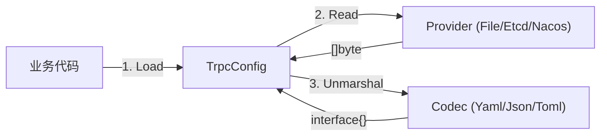
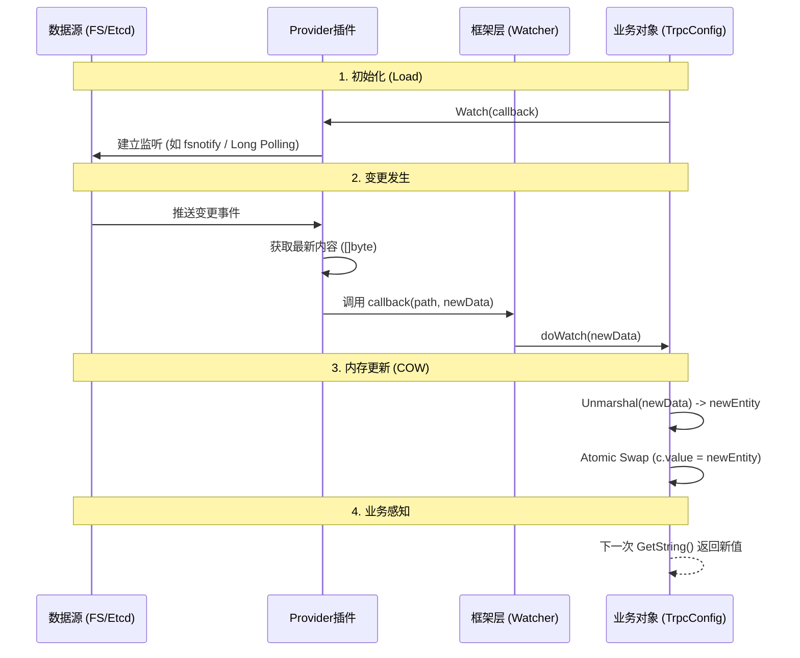
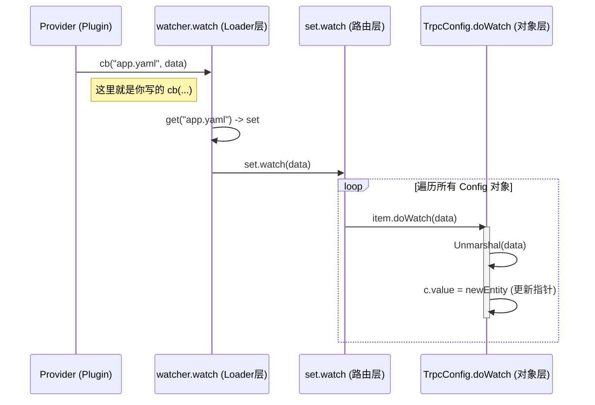
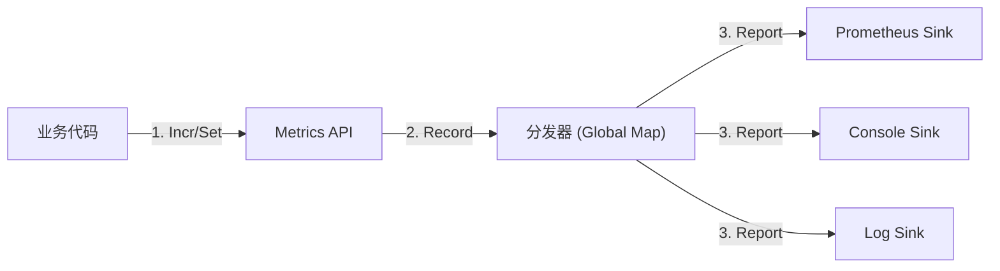

# 配置中心与可观测性

---

- `config`:配置模块

- `metrics`:指标模块
- `log`:日志模块
- `rpcz`:监控模块
- `errs`:错误模块

- `admin`:管理模块

---

# config 配置模块

> 核心源码路径：`trpc-go/config`

`config` 模块主要用于管理**业务配置**。

## 1. 核心设计哲学

在源码阅读中，我们发现了 `config` 模块的三个核心角色，它们分工明确：

1.  **Provider (搬运工)**：只负责把数据搬运回来，返回 `[]byte`。它不关心内容是 JSON 还是 YAML，也不关心数据存在哪里（本地文件、ETCD、Nacos）。
2.  **Codec (翻译官)**：只负责把 `[]byte` 解析成 Go 对象（map/struct）。
3.  **TrpcConfig (管家)**：面向用户的统一入口，负责组装 Provider 和 Codec，并提供 `GetString/GetInt` 等方法。



## 2. 源码深度解析

### 2.1 抽象接口 (Provider)

`DataProvider` 接口的设计体现了**关注点分离**：

```go
// trpc-go/config/config.go
type DataProvider interface {
    Name() string
    // Read 返回 []byte，体现了对数据格式的无感知
    Read(string) ([]byte, error)
    // Watch 采用推模式 (Push)，注册回调函数
    Watch(ProviderCallback)
}
```

### 2.2 并发安全机制 (COW)

在 `TrpcConfig` 的更新逻辑中，有一个精彩的并发处理细节：

```go
// trpc-go/config/trpc_config.go

func (c *TrpcConfig) set(data []byte) error {
    // 1. 创建新对象
    e := newEntity()
    // 2. 解析数据到新对象
    c.decoder.Unmarshal(data, &e.data)
    // 3. 替换指针 (Atomic swap 的效果)
    c.value = e 
    return nil
}
```

**设计亮点**：
-   **读写分离**：读操作直接读取 `c.value` 指针，无需加锁（或者只需极轻量的锁）。
-   **写操作**：在局部变量中完成耗时的解析工作，最后通过一次指针赋值完成更新。
-   这是一种适合**读多写少**场景的优化策略。

## 3. 实战指南

### 3.1 加载本地配置

```go
// 默认使用 FileProvider + YamlCodec
cfg, _ := config.Load("app.yaml")
timeout := cfg.GetInt("server.timeout", 1000)
```

### 3.2 接入远程配置中心 (如 Nacos/Rainbow)

虽然框架核心只内置了 `file` Provider，但通过插件机制可以轻松扩展。

**原理**：
1.  引入对应的插件包（如 `trpc-config-nacos`）。
2.  插件会在 `init()` 中调用 `config.RegisterProvider` 注册自己。
3.  在 `Load` 时指定 Provider 名称。

```go
import _ "trpc.group/trpc-go/trpc-config-nacos/plugin"

func main() {
    // 告诉框架：去 "nacos" 读，用 "json" 解
    cfg, _ := config.Load("data-id-in-nacos", 
        config.WithProvider("nacos"), 
        config.WithCodec("json"),
    )
}
```

## 4. 常见误区

-   **误区1**：认为 `TrpcConfig` 只能解析 YAML。
    -   **真相**：虽然名字叫 `TrpcConfig` 且注释里提到了 YAML，但它实际上支持任何注册过的 Codec (JSON, TOML 等)，只是默认初始化使用YAML + FIle的组合。
-   **误区2**：需要自己写 `for` 循环去 Watch 配置变化。
    -   **真相**：`config.Load` 返回的对象会自动在后台维护最新值，业务代码只需调用 `GetXxx` 即可。

---

## 5. 核心专题：热更新机制深度解析

`config` 模块最精妙的设计在于其热更新（Hot Reload）机制，它通过**三层架构**实现了从底层变更到上层感知的全链路打通。

### 5.1 流程图解



### 5.2 职责划分

在这个机制中，**框架**和**插件**的职责边界非常清晰：

1.  **插件 (Plugin) 的责任**：
    -   **脏活累活全包**：负责与外部系统（ETCD/Nacos/OS）打交道。
    -   **连接管理**：处理网络连接、心跳、断线重连。
    -   **监听实现**：利用外部系统的 SDK（如 `client.Watch`）监听变更。
    -   **契约履行**：一旦发现变更，必须调用框架传入的 `callback` 函数，把最新的 `[]byte` 喂给框架。

2.  **框架 (Framework) 的责任**：
    -   **提供回调**：定义标准回调函数 `func(path, data)`。
    -   **解析数据**：收到 data 后，调用 Codec 进行反序列化。
    -   **并发安全**：通过指针替换（Copy-On-Write）确保业务读取时的线程安全。

### 5.3 源码验证与调用链追踪

**Provider 侧 (以 FileProvider 为例)**：
```go
// config/provider.go
func (fp *FileProvider) run() {
    for {
        select {
        case e := <-fp.watcher.Events: // 监听 OS 信号
            if t, ok := fp.isModified(e); ok {
                // 触发回调，履行契约
                fp.trigger(e, t, fn) 
            }
        }
    }
}
```

**框架侧 (Callback 的真身)**：
当 Provider 调用 `cb(path, data)` 时，实际上是在执行 `TrpcConfigLoader` 注入的 `w.watch` 方法。整个调用链如下：



## 6. 实战避坑指南：自定义 Provider

在 `examples/custom_config_provider` 中，我们模拟了一个远程配置中心。通过实战我们发现了几个关键点：

1.  **必须显式开启 Watch**：
    `config.Load` 默认**不会**开启 Watch 功能。必须加上 `config.WithWatch()` 选项，否则框架会忽略 Provider 发来的所有更新。
    ```go
    config.Load("app.yaml", 
        config.WithProvider("my-remote"), 
        config.WithWatch(), // <--- 关键！
    )
    ```

2.  **Channel 的缓冲设计**：
    在实现 Watch 时，推荐使用带缓冲的 Channel 配合 `select + default` 进行非阻塞推送，防止因为某个消费者卡顿而拖垮整个 Watch 循环。

---

# metrics 指标模块

> 核心源码路径：`trpc-go/metrics`

Metrics（指标）是服务的仪表盘，用于将服务内部的隐形状态（如 QPS、耗时、内存）转化为可视化的数字。

## 1. 核心概念与数据类型

在 `trpc-go` 中，Metrics 主要包含三种核心数据类型，分别对应不同的监控场景：

1.  **Counter (计数器)**
    -   **特点**：只增不减（除非重启）。
    -   **场景**：请求总数、错误总数、订单量。
    -   **API**：`Incr()`, `IncrBy(v)`

2.  **Gauge (仪表盘)**
    -   **特点**：可增可减，反映当前瞬时状态。
    -   **场景**：CPU 使用率、当前队列长度、Goroutine 数量。
    -   **API**：`Set(v)`

3.  **Timer / Histogram (直方图)**
    -   **特点**：统计数据的分布情况（P99, P50, Max, Min）。
    -   **场景**：接口响应耗时、RPC 调用耗时、包大小分布。
    -   **API**：`RecordDuration(d)`

## 2. 架构设计：Sink 模式

Metrics 模块采用了经典的 **Fan-out (扇出)** 设计，将“打点”与“存储”解耦。

-   **Source (埋点)**：业务代码调用 `metrics.Incr()`。
-   **Sink (下沉)**：数据最终去向（Console, Prometheus, InfluxDB）。



## 3. 源码深度解析

### 3.1 注册与分发

框架内部维护了一个全局的 Sink 列表：

```go
// metrics/metrics.go
var metricsSinks = map[string]Sink{}

// 注册 Sink
func RegisterMetricsSink(sink Sink) {
    metricsSinksMutex.Lock()
    metricsSinks[sink.Name()] = sink
    metricsSinksMutex.Unlock()
}

// 触发打点 (以 Counter 为例)
func (c *counter) IncrBy(delta float64) {
    // 1. 封装成标准 Record
    r := NewSingleDimensionMetrics(c.name, delta, PolicySUM)
    
    // 2. 遍历所有 Sink 进行分发
    for _, sink := range metricsSinks {
        sink.Report(r)
    }
}
```

### 3.2 生产环境实践

在实际生产中，我们很少手动调用 `RegisterMetricsSink`，而是通过 **配置文件 + 插件** 自动完成。

**配置示例 (trpc_go.yaml)**：
```yaml
plugins:
  metrics:
    prometheus: # 启用 Prometheus 插件
      ip: 0.0.0.0
      port: 8080
```

**原理**：
1.  引入插件包：`import _ "trpc-metrics-prometheus/plugin"`。
2.  框架启动时读取配置。
3.  插件自动初始化 `PrometheusSink` 并调用 `RegisterMetricsSink`。

## 4. 概念辨析：埋点 vs 指标

| 概念 | 英文 | 侧重点 | 类比 |
| :--- | :--- | :--- | :--- |
| **埋点** | Instrumentation | **动作 (Process)**<br>关注代码在哪里写，何时采集。 | 安装摄像头 |
| **指标** | Metrics | **结果 (Result)**<br>关注聚合后的数值，业务含义。 | 统计车流量报告 |

## 5. 实战避坑指南

-   **Timer 的 API**：注意 `Timer` 接口有 `Record()` (自动计算从 start 开始的时间) 和 `RecordDuration(d)` (记录指定时间)。如果你自己计算了耗时，请用后者。
-   **Sink 性能**：`ConsoleSink` 是同步打印，生产环境**严禁**开启，否则高 QPS 下会把磁盘或 CPU 打爆。生产环境应使用异步或聚合发送的 Sink (如 Prometheus)。

---

# log 日志模块

> 核心源码路径：`trpc-go/log`

日志模块是微服务可观测性的基石，`trpc-go` 默认集成了高性能的 `zap` 库，并提供了多输出源、异步写入和日志切割等企业级特性。

## 1. 核心架构特性

1.  **基于 Zap**：底层默认使用 Uber 的 `zap` 库，性能强悍。
2.  **多输出源 (Multi-Output)**：支持同时输出到 Console（控制台）和 File（文件），且可为不同输出源设置不同的 Log Level。
3.  **异步写入 (Async Write)**：默认开启异步缓冲写入，防止磁盘 IO 阻塞业务线程，并在高负载下支持丢弃策略（DropLog）以保护服务。
4.  **自动切割 (RollWriter)**：内置 `rollwriter`，支持按大小（Size）或时间（Time）自动切割日志文件，并管理备份数量（MaxBackups）和保留时间（MaxAge）。

## 2. 配置指南 (YAML vs Code)

### 2.1 YAML 配置 (推荐)

在 `trpc_go.yaml` 中配置，无需改动代码即可调整日志行为。

```yaml
plugins:
  log:
    default: # 默认 Logger 配置数组
      - writer: console
        level: debug    # 开发环境开启 Debug
        formatter: console
      
      - writer: file
        level: info     # 生产环境只记 Info
        formatter: json # 机器友好格式
        writer_config:
          filename: trpc.log
          roll_type: size      # 按大小切割
          max_size: 100        # 100MB
          max_backups: 10      # 保留 10 个备份
          max_age: 7           # 保留 7 天
          compress: true       # 压缩旧日志 (.gz)
```

### 2.2 代码配置 (动态调整)

```go
cfg := log.Config{
    {
        Writer: "console",
        Level:  "debug",
    },
    // ... 其他 OutputConfig
}
log.SetLogger(log.NewZapLog(cfg))
```

## 3. API 设计哲学

`trpc-go` 对 `zap` 进行了封装，提供了一套更符合 Go 开发者习惯的接口。

| 特性 | trpc-go API | Zap 原生 API | 评价 |
| :--- | :--- | :--- | :--- |
| **格式化** | `log.Infof("uid: %d", 123)` | `sugar.Infof` | 方便，类似 `fmt.Printf` |
| **结构化** | `log.With(Field{Key:"k", Val:"v"}).Info("msg")` | `logger.Info("msg", zap.String("k", "v"))` | 解耦了对 Zap 类型的依赖 |
| **上下文** | `log.TraceContext(ctx, "msg")` | 无直接对应 | **核心特性**：自动提取 Context 中的 TraceID 打印到日志中 |

## 5. 生产环境避坑：Console 同步写入

这是一个极易被忽视的性能陷阱。

### 5.1 源码证据

在 `trpc-go` 中，文件日志 (`writer: file`) 默认使用了 `AsyncRollWriter`（异步写入）。
但是，控制台日志 (`writer: console`) 却是**同步写入**的！

```go
// trpc-go/log/zaplogger.go

// File: 使用了异步写入器
func newFileCore(...) {
    // ...
    ws = rollwriter.NewAsyncRollWriter(writer, rollwriter.WithDropLog(true))
    // ...
}

// Console: 直接锁定了 os.Stdout，是同步的！
func newConsoleCore(...) {
    return zapcore.NewCore(
        newEncoder(c),
        zapcore.Lock(os.Stdout), // <--- 同步锁
        lvl), lvl
}
```

### 5.2 风险与建议

-   **风险**：在高 QPS 场景下，`os.Stdout` 的写入可能会因为终端或 Pipe 缓冲区满而阻塞，进而拖垮整个业务线程。
-   **建议**：
    1.  **生产环境关闭 Console**：除非你的日志收集架构（如 K8s EFK）强制要求采集 Stdout。
    2.  **调高 Level**：如果必须开启，请将 Level 设置为 `error`，仅打印关键错误。
    3.  **主力走 File**：利用文件日志的异步和丢弃策略来抗住大流量。

---

# rpcz 本地监控模块

> 核心源码路径：`trpc-go/rpcz`

`rpcz` 模块是 `trpc-go` 框架内部实现的一套**本地链路追踪系统**。它的设计灵感来源于 Google 的 Dapper/RPCZ 和 OpenTelemetry，但去除了跨进程传播的复杂性，专注于**单机/单进程内**的请求全生命周期监控。

## 1. 核心概念

-   **Span (跨度)**：追踪的基本单位。代表一个操作（如 RPC 调用、DB 查询）。包含 StartTime, EndTime, Children 等信息。
-   **SpanID**：Span 的唯一标识符 (`int64`)。
    -   **注意**：在 `rpcz` 中，`SpanID` 实际上扮演了 "Local TraceID" 的角色。你会发现父子 Span 的 ID 往往是相同的，这是因为 `rpcz` 主要通过内存对象引用 (`ChildSpans`) 来维护层级，ID 主要用于标识**这一个请求**。
-   **GlobalRPCZ**：全局单例管理器。负责配置采样率、存储 Span 数据。
-   **SpanStore**：内存存储引擎。使用**环形缓冲区 (Ring Buffer)** 存储最近 N 个 Span，供调试查看。

## 2. 源码深度解析

### 2.1 全局单例与配置

`rpcz` 模块通过一个全局变量 `GlobalRPCZ` 来工作。

```go
// trpc-go/rpcz/rpcz.go
var GlobalRPCZ = NewRPCZ(&Config{Fraction: 0.0, Capacity: 1}) // 默认关闭 (Fraction=0)
```

**关键点**：默认情况下 `Fraction` 为 0.0，这意味着如果不显式配置（在 YAML 或代码中），`rpcz` 不会记录任何数据。

### 2.2 上下文传播 (Context Propagation)

`rpcz` 强依赖 Go 的 `context.Context` 来维护 Span 的父子关系。

```go
// trpc-go/rpcz/context.go

func NewSpanContext(ctx context.Context, name string) (Span, Ender, context.Context) {
    // 1. 从 ctx 取出父 Span (如果没有，则使用 GlobalRPCZ 作为 "空" 父节点)
    span := SpanFromContext(ctx)
    
    // 2. 创建子 Span
    // 注意：这里会复用父 Span 的 ID (s.id)，这是 rpcz 特有的设计，与 OTel 不同
    newSpan, end := span.NewChild(name)
    
    // 3. 将新 Span 塞回 Context，供下游使用
    return newSpan, end, ContextWithSpan(ctx, newSpan)
}
```

### 2.3 存储机制 (Ring Buffer)

为了避免内存无限增长，`SpanStore` 使用了环形队列设计：

```go
// trpc-go/rpcz/spanstore.go
type spanStore struct {
    spans []*ReadOnlySpan
    index int           // 当前写入位置
    cap   int           // 容量
    mu    sync.RWMutex
}

func (s *spanStore) insert(span *span) {
    s.mu.Lock()
    defer s.mu.Unlock()
    // 覆盖写：当写满时，新 Span 会覆盖最老的 Span
    s.spans[s.index] = span.convertedToReadOnlySpan()
    s.index = (s.index + 1) % s.cap
}
```

## 3. 实战指南

### 3.1 开启 RPCZ

**方式一：配置文件 (推荐)**

```yaml
# trpc_go.yaml
global:
  rpcz:
    fraction: 1.0   # 采样率：1.0 表示 100% 采集，0.01 表示 1%
    capacity: 1000  # 内存中保留最近 1000 条记录
```

**方式二：代码开启 (Debug 用)**

```go
rpcz.GlobalRPCZ = rpcz.NewRPCZ(&rpcz.Config{
    Fraction: 1.0,
    Capacity: 100,
})
```

### 3.2 手动埋点

除了框架自动生成的 Server/Client Span，业务也可以手动创建 Span 来监控关键逻辑耗时。

```go
func BusinessLogic(ctx context.Context) {
    // 1. 开始埋点
    span, end, ctx := rpcz.NewSpanContext(ctx, "CalculateRank")
    defer end.End() // 别忘了结束！
    
    // 2. 添加自定义属性
    span.SetAttribute("user_id", 12345)
    
    // 3. 模拟业务耗时
    time.Sleep(50 * time.Millisecond)
}
```

## 4. 深度对比：RPCZ vs OpenTelemetry

这是初学者最容易混淆的部分。

| 特性 | RPCZ (trpc-go 内置) | OpenTelemetry (标准生态) |
| :--- | :--- | :--- |
| **定位** | **本地调试工具** (Local Debugger) | **分布式追踪标准** (Distributed Tracing) |
| **作用范围** | 仅当前进程 (Process-local) | 跨越微服务集群 (Cross-service) |
| **ID 机制** | **复用 ID** (父子 Span ID 相同，标识同一请求) | **唯一 ID** (每个 Span ID 唯一，TraceID 全局唯一) |
| **数据存储** | 内存 Ring Buffer (重启即失) | 外部存储 (ElasticSearch, Cassandra, Jaeger) |
| **查看方式** | Admin 接口 / 命令行 / 本地日志 | Jaeger UI / Zipkin UI / Grafana |
| **适用场景** | 查单机函数耗时、框架内部细节 | 查全链路依赖、分布式故障定位 |

### 4.1 为什么 rpcz 的 SpanID 是一样的？

在 `rpcz` 中，`SpanID` 更像是一个 "TraceID"。它的设计目标是低开销地记录单机内的调用栈。
-   **源码证据**：`span.NewChild(name)` 内部调用 `newSpan(name, s.id, s)`，直接透传了 `s.id`。
-   **关联方式**：父子关系不依赖 ID 匹配，而是直接依赖内存中的指针引用 (`ChildSpans` 数组)。

### 4.2 如何在 trpc-go 中使用 OpenTelemetry？

如果需要标准的分布式追踪，不能使用 `rpcz` 包，而应使用 `trpc-ecosystem/go-opentelemetry` 插件。

**核心原理：拦截器 (Filter)**
OTel 的接入完全依赖 Filter 机制，对业务代码无侵入（除非需要手动打点）。

1.  **Server Filter**：从请求头 (`trpc-trace-id`) 提取 Trace Context，生成 Server Span。
2.  **Client Filter**：将当前的 Trace Context 注入到下游请求头。

**配置示例**：

```yaml
plugins:
  telemetry:
    opentelemetry:
      addr: 127.0.0.1:4318 # OTLP Collector 地址
      sampler:
        fraction: 1.0
server:
  filter:
    - opentelemetry # 开启服务端追踪
client:
  filter:
    - opentelemetry # 开启客户端追踪 (透传)
```

---

# errs 错误处理模块

> 核心源码路径：`trpc-go/errs`

`errs` 模块定义了 `trpc-go` 框架统一的错误处理规范。它不仅是一个简单的错误库，更是微服务间错误传播的标准协议。

## 1. 核心设计哲学

传统的 Go `error` 只是一个字符串。而在微服务架构中，我们需要更结构化的错误信息，以便于监控、告警和自动重试。

`trpc-go` 的错误对象包含三个核心要素：
1.  **Type (错误类型)**：区分是框架报错（网络中断、超时）还是业务报错（余额不足、参数错误）。
2.  **Code (错误码)**：整型状态码。框架预留了 `RetOK=0` 和一系列负数错误码，建议业务使用正整数。
3.  **Msg (错误信息)**：人类可读的描述。

```go
// trpc-go/errs/errs.go
type Error struct {
    Type int
    Code trpcpb.TrpcRetCode
    Msg  string
    Desc string
    cause error      // 支持 Go 1.13+ 的错误链 (Unwrap)
    stack stackTrace // 错误堆栈
}
```

## 2. 常用 API 实战

### 2.1 创建错误

**场景一：返回业务错误**
最常用的方式。`Type` 默认为 `ErrorTypeBusiness`。

```go
// 方式 1：直接创建
err := errs.New(1001, "invalid user id")

// 方式 2：带格式化
err := errs.Newf(1002, "user %d not found", uid)
```

**场景二：包装底层错误 (Wrap)**
保留原始错误堆栈，同时增加业务语义。

```go
if err != nil {
    // 原始 err 会被存入 cause 字段
    return errs.Wrap(err, 1003, "query db failed")
}
```

**场景三：创建框架错误**
一般由框架内部使用（如超时、编解码失败），业务层很少直接创建，除非你在写插件。

```go
err := errs.NewFrameError(errs.RetServerTimeout, "handle timeout")
```

### 2.2 消费错误 (Client 端)

当 Client 收到远程调用返回的 `err` 时，不要直接用 `err.Error()` 字符串匹配，而应该用标准方法提取 Code。

```go
rsp, err := proxy.SayHello(ctx, req)
if err != nil {
    // 1. 获取错误码
    code := errs.Code(err)
    
    // 2. 获取错误信息
    msg := errs.Msg(err)
    
    // 3. 判断特定错误 (如超时)
    if code == errs.RetClientTimeout {
        // 触发重试逻辑...
    }
    
    // 4. 判断业务错误
    if code == 1001 {
        // 提示用户...
    }
}
```

## 3. 进阶特性：错误堆栈 (Stack Trace)

默认情况下，`errs` 创建的错误不带堆栈信息（为了性能）。在调试环境，开启堆栈对定位问题非常有帮助。

**开启方式**：
在 `main` 函数初始化时设置：

```go
func init() {
    // 开启堆栈记录
    errs.SetTraceable(true) 
}
```

开启后，打印 error (`%+v`) 时会包含调用栈信息。

## 4. 源码深度解析：错误传播机制

当 Server 端返回一个 `errs.Error` 时，框架是如何传给 Client 的？

1.  **Server 端**：拦截器捕获 `handler` 返回的 error。
    -   如果 error 是 `errs.Error` 类型，提取 `Code` 和 `Msg`。
    -   如果 error 是普通 `error`，自动转换为 `RetUnknown` (999)。
    -   将 Code 和 Msg 写入协议头（如 `trpc-ret` 和 `trpc-func-ret`）。

2.  **网络传输**：错误码和信息跟随 Response Protocol 头传输，**堆栈信息不会传输**（跨服务传输堆栈不安全且流量大）。

3.  **Client 端**：框架收到 Response。
    -   检查协议头中的 `trpc-ret`。
    -   如果非 0，自动还原为一个 `errs.Error` 对象抛给上层调用者。

这就是为什么你在 Client 端能收到 Server 端定义的错误码。

---

# admin 管理模块

> 核心源码路径：`trpc-go/admin`

`admin` 模块是 `trpc-go` 框架内置的**后台管理服务**。它不需要业务代码干预，框架启动时默认会在本地监听一个 HTTP 端口（默认 `9028` 或 `8000` 附近的空闲端口，取决于配置），提供了一系列运维和调试接口。

## 1. 核心功能

Admin 模块就像是微服务的“仪表盘”，通过 HTTP 接口暴露以下能力：

1.  **健康检查 (Health Check)**: K8s 或负载均衡器通过此接口探测服务是否存活。
2.  **配置查看 (Config)**: 查看服务当前加载的完整配置。
3.  **日志调整 (Log Level)**: **动态修改**日志级别（如从 Info 改为 Debug），无需重启服务。
4.  **性能分析 (Pprof)**: 集成了 Go 标准库的 `pprof`，可在线抓取 CPU/Memory Profile。
5.  **链路追踪 (RPCZ)**: 查看最近的请求调用链详情。

## 2. 常用接口清单

假设 Admin 监听在 `localhost:9028`：

| 功能 | URL 路径 | 方法 | 描述 |
| :--- | :--- | :--- | :--- |
| **命令列表** | `/cmds` | GET | 列出所有支持的管理命令 |
| **版本信息** | `/version` | GET | 查看框架和业务版本 |
| **健康检查** | `/is_healthy/` | GET | 返回 200 OK 表示服务正常 |
| **日志级别** | `/cmds/loglevel` | PUT | 动态修改日志级别 (e.g. `value=debug`) |
| **查看配置** | `/cmds/config` | GET | 返回当前的 JSON 格式配置 |
| **RPCZ 列表** | `/cmds/rpcz/spans` | GET | 查看最近 N 个请求 Span 概览 |
| **RPCZ 详情** | `/cmds/rpcz/spans/{id}` | GET | 查看指定 Span 的详细调用树 |
| **Pprof** | `/debug/pprof/` | GET | Go 性能分析入口 |

## 3. 实战配置

在 `trpc_go.yaml` 中配置 `admin` 节点：

```yaml
server:
  app: demo
  server: main
  admin:
    ip: 127.0.0.1  # 监听地址
    port: 9028     # 监听端口
    read_timeout: 3000
    write_timeout: 3000
```

## 4. 源码深度解析：动态修改日志级别

这是一个非常实用的功能，我们看看它是如何实现的。

```go
// trpc-go/admin/admin.go

func (s *Server) handleLogLevel(w http.ResponseWriter, r *http.Request) {
    // ... 解析请求参数 ...
    
    // 1. 获取 logger 实例 (默认是 "default")
    logger := log.Get(name)
    
    if r.Method == http.MethodPut {
        // 2. 获取新的 level 字符串 (如 "debug")
        level := r.PostForm.Get("value")
        
        // 3. 动态设置 Level
        // 注意：这里依赖 log 模块的原子操作或锁机制来保证线程安全
        logger.SetLevel(output, log.LevelNames[level])
        
        // 4. 返回修改后的结果
        ret["level"] = getLevel(logger, output)
        _ = json.NewEncoder(w).Encode(ret)
    }
}
```

## 5. 扩展自定义管理命令

除了框架自带的命令，业务也可以注册自己的管理接口（例如：查看当前内存缓存大小）。

```go
import "trpc.group/trpc-go/trpc-go/admin"

func init() {
    // 注册路由: /cmds/cache_size
    admin.HandleFunc("/cmds/cache_size", func(w http.ResponseWriter, r *http.Request) {
        size := myCache.Size()
        w.Write([]byte(fmt.Sprintf("Current cache size: %d", size)))
    })
}
```

