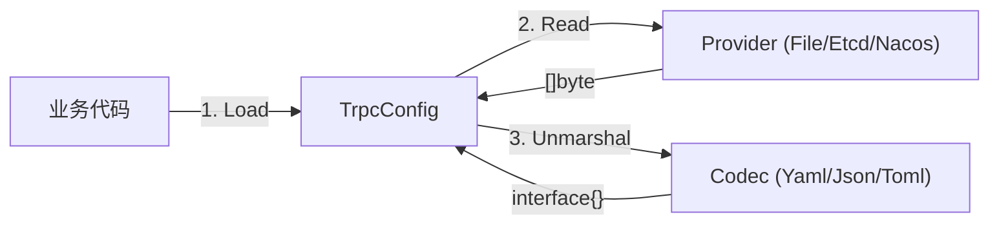
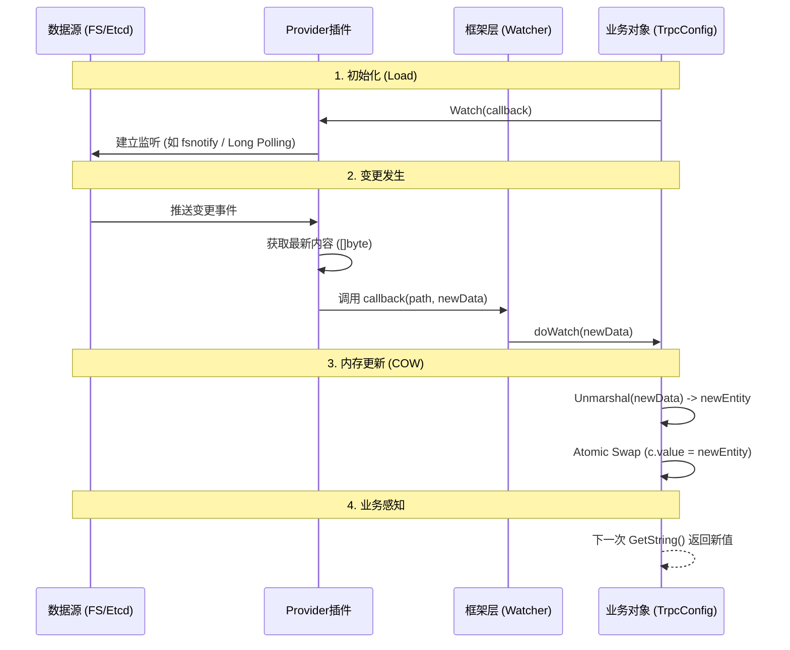
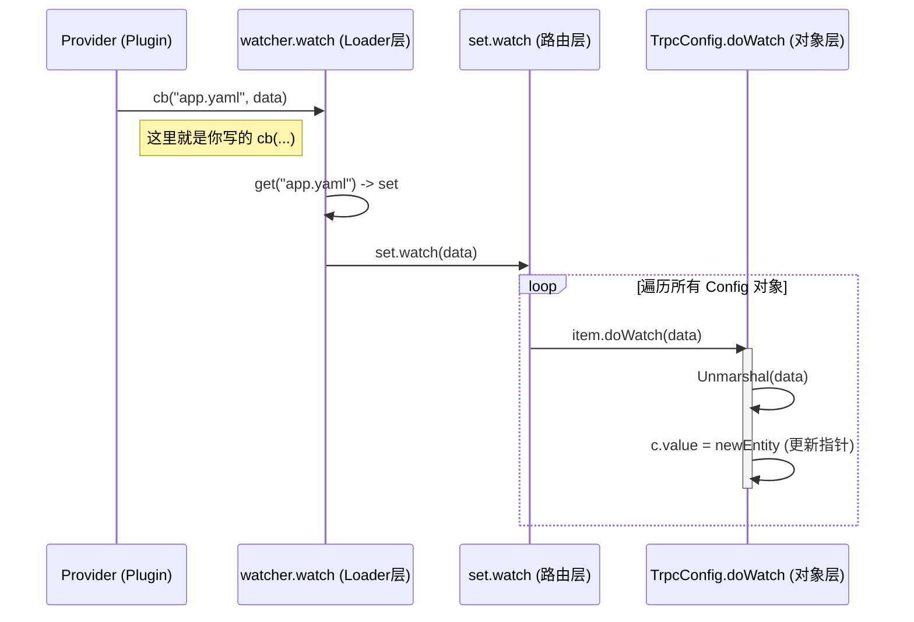

# 配置中心与可观测性

---

- `config`:配置模块

- `metrics`:指标模块
- `log`:日志模块
- `rpcz`:监控模块
- `errs`:错误模块

- `admin`:管理模块

---

# config 配置模块

> 核心源码路径：`trpc-go/config`

`config` 模块主要用于管理**业务配置**。

## 1. 核心设计哲学

在源码阅读中，我们发现了 `config` 模块的三个核心角色，它们分工明确：

1.  **Provider (搬运工)**：只负责把数据搬运回来，返回 `[]byte`。它不关心内容是 JSON 还是 YAML，也不关心数据存在哪里（本地文件、ETCD、Nacos）。
2.  **Codec (翻译官)**：只负责把 `[]byte` 解析成 Go 对象（map/struct）。
3.  **TrpcConfig (管家)**：面向用户的统一入口，负责组装 Provider 和 Codec，并提供 `GetString/GetInt` 等方法。



## 2. 源码深度解析

### 2.1 抽象接口 (Provider)

`DataProvider` 接口的设计体现了**关注点分离**：

```go
// trpc-go/config/config.go
type DataProvider interface {
    Name() string
    // Read 返回 []byte，体现了对数据格式的无感知
    Read(string) ([]byte, error)
    // Watch 采用推模式 (Push)，注册回调函数
    Watch(ProviderCallback)
}
```

### 2.2 并发安全机制 (COW)

在 `TrpcConfig` 的更新逻辑中，有一个精彩的并发处理细节：

```go
// trpc-go/config/trpc_config.go

func (c *TrpcConfig) set(data []byte) error {
    // 1. 创建新对象
    e := newEntity()
    // 2. 解析数据到新对象
    c.decoder.Unmarshal(data, &e.data)
    // 3. 替换指针 (Atomic swap 的效果)
    c.value = e 
    return nil
}
```

**设计亮点**：
-   **读写分离**：读操作直接读取 `c.value` 指针，无需加锁（或者只需极轻量的锁）。
-   **写操作**：在局部变量中完成耗时的解析工作，最后通过一次指针赋值完成更新。
-   这是一种适合**读多写少**场景的优化策略。

## 3. 实战指南

### 3.1 加载本地配置

```go
// 默认使用 FileProvider + YamlCodec
cfg, _ := config.Load("app.yaml")
timeout := cfg.GetInt("server.timeout", 1000)
```

### 3.2 接入远程配置中心 (如 Nacos/Rainbow)

虽然框架核心只内置了 `file` Provider，但通过插件机制可以轻松扩展。

**原理**：
1.  引入对应的插件包（如 `trpc-config-nacos`）。
2.  插件会在 `init()` 中调用 `config.RegisterProvider` 注册自己。
3.  在 `Load` 时指定 Provider 名称。

```go
import _ "trpc.group/trpc-go/trpc-config-nacos/plugin"

func main() {
    // 告诉框架：去 "nacos" 读，用 "json" 解
    cfg, _ := config.Load("data-id-in-nacos", 
        config.WithProvider("nacos"), 
        config.WithCodec("json"),
    )
}
```

## 4. 常见误区

-   **误区1**：认为 `TrpcConfig` 只能解析 YAML。
    -   **真相**：虽然名字叫 `TrpcConfig` 且注释里提到了 YAML，但它实际上支持任何注册过的 Codec (JSON, TOML 等)，只是默认初始化使用YAML + FIle的组合。
-   **误区2**：需要自己写 `for` 循环去 Watch 配置变化。
    -   **真相**：`config.Load` 返回的对象会自动在后台维护最新值，业务代码只需调用 `GetXxx` 即可。

---

## 5. 核心专题：热更新机制深度解析

`config` 模块最精妙的设计在于其热更新（Hot Reload）机制，它通过**三层架构**实现了从底层变更到上层感知的全链路打通。

### 5.1 流程图解



### 5.2 职责划分

在这个机制中，**框架**和**插件**的职责边界非常清晰：

1.  **插件 (Plugin) 的责任**：
    -   **脏活累活全包**：负责与外部系统（ETCD/Nacos/OS）打交道。
    -   **连接管理**：处理网络连接、心跳、断线重连。
    -   **监听实现**：利用外部系统的 SDK（如 `client.Watch`）监听变更。
    -   **契约履行**：一旦发现变更，必须调用框架传入的 `callback` 函数，把最新的 `[]byte` 喂给框架。

2.  **框架 (Framework) 的责任**：
    -   **提供回调**：定义标准回调函数 `func(path, data)`。
    -   **解析数据**：收到 data 后，调用 Codec 进行反序列化。
    -   **并发安全**：通过指针替换（Copy-On-Write）确保业务读取时的线程安全。

### 5.3 源码验证与调用链追踪

**Provider 侧 (以 FileProvider 为例)**：
```go
// config/provider.go
func (fp *FileProvider) run() {
    for {
        select {
        case e := <-fp.watcher.Events: // 监听 OS 信号
            if t, ok := fp.isModified(e); ok {
                // 触发回调，履行契约
                fp.trigger(e, t, fn) 
            }
        }
    }
}
```

**框架侧 (Callback 的真身)**：
当 Provider 调用 `cb(path, data)` 时，实际上是在执行 `TrpcConfigLoader` 注入的 `w.watch` 方法。整个调用链如下：



## 6. 实战避坑指南：自定义 Provider

在 `examples/custom_config_provider` 中，我们模拟了一个远程配置中心。通过实战我们发现了几个关键点：

1.  **必须显式开启 Watch**：
    `config.Load` 默认**不会**开启 Watch 功能。必须加上 `config.WithWatch()` 选项，否则框架会忽略 Provider 发来的所有更新。
    ```go
    config.Load("app.yaml", 
        config.WithProvider("my-remote"), 
        config.WithWatch(), // <--- 关键！
    )
    ```

2.  **Channel 的缓冲设计**：
    在实现 Watch 时，推荐使用带缓冲的 Channel 配合 `select + default` 进行非阻塞推送，防止因为某个消费者卡顿而拖垮整个 Watch 循环。

---

# metrics 指标模块