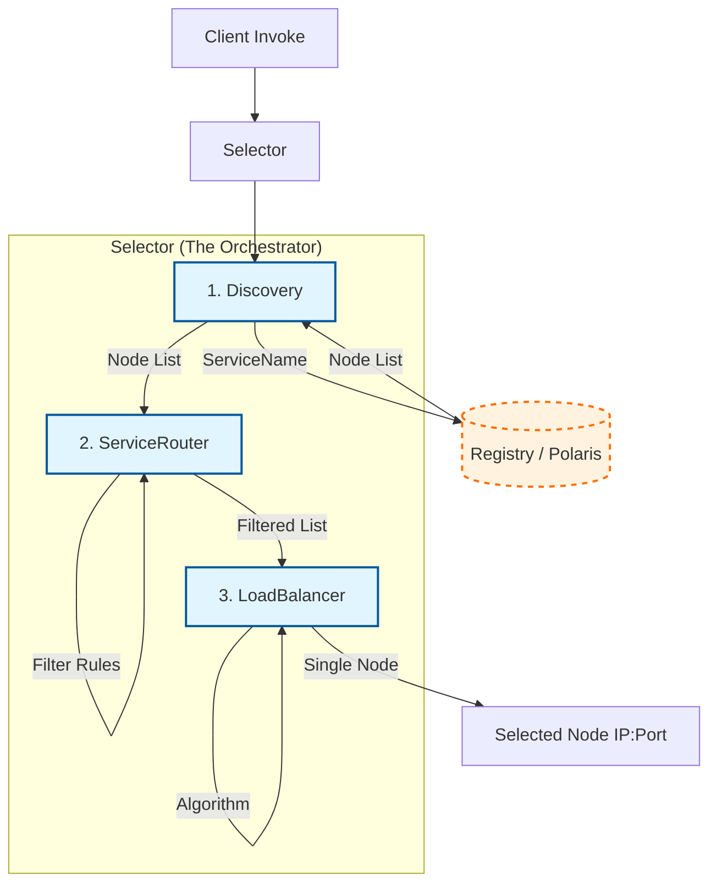

# 微服务治理 (Microservice Governance)

微服务治理是分布式系统的灵魂。在这个阶段，我们将不再关注单个请求的收发，而是关注**服务与服务之间的关系**。

# 1. 寻址架构 (Naming Framework)

## 寻址架构总览

- **目标**：理解 `trpc-go` 的 `naming` 包设计。
- **关键问题**：一个服务名（Service Name）是如何一步步变成一个 IP 地址的？
- **核心接口**：
    - `Selector` (编排者)：对外黑盒，内部按顺序调用 `Discovery`、`ServiceRouter`、`LoadBalancer`。
        - `Discovery` (发现者)：根据服务名拉取节点列表。
        - `ServiceRouter` (服务路由)：根据路由规则筛选节点。
        - `LoadBalancer` (选择者)：根据负载均衡算法选择一个节点。
- **插件化** ：每个 Step 都可以替换（比如把 `Discovery` 换成 ETCD，把 `Algorithm` 换成 `ConsistentHash`）。


---

## Discovery 发现者

- **目标**：根据服务名拉取节点列表。
- **接口**：
```go
// naming/discovery/discovery.go

type Discovery interface {
    List(serviceName string, opt ...Option) (nodes []*registry.Node, err error)
}
```
- 无论是 **IP 直连、K8s DNS、ETCD、Polaris**，最终都要归结为“给我一个名字，我给你一堆节点”。

---

- 默认实现：IP寻址
```go
// naming/discovery/ip_discovery.go

// List returns the original IP/Port.
func (*IPDiscovery) List(serviceName string, opt ...Option) ([]*registry.Node, error) {
	node := &registry.Node{ServiceName: serviceName, Address: serviceName}
	return []*registry.Node{node}, nil
}

// 输入: "127.0.0.1:8000"
// 输出: Node{ Address: "127.0.0.1:8000" }
```

---

如果是真正的注册中心（比如北极星）， List 方法会复杂得多：

1. 缓存层 ：先查本地缓存（避免每次都网络请求）。
2. 网络层 ：如果缓存失效，发起 HTTP/UDP 请求去服务端拉取。
3. 解析层 ：把服务端返回的 JSON/XML 解析成 []*registry.Node 。

---

## ServiceRouter 服务路由

- **目标**：根据路由规则，将服务发现返回的节点进一步筛选。
- **接口**：
```go
// naming/servicerouter/servicerouter.go

type ServiceRouter interface {
    Filter(serviceName string, nodes []*registry.Node, opt ...Option) ([]*registry.Node, error)
}
```

- **默认实现**：`NoopServiceRouter`直接返回所有节点，不做任何过滤

---

## LoadBalancer 负载均衡

- **目标**：根据负载均衡算法，从服务路由的节点列表中选择真正要请求的那个节点。
- **接口**：
```go
// naming/loadbalance/loadbalance.go

type LoadBalancer interface {
    Select(serviceName string, list []*registry.Node, opt ...Option) (node *registry.Node, err error)
}
```

- **默认实现**：`RandomLoadBalancer`随机选择一个节点。

---

# 2. 熔断 (Circuit Breaker)
熔断器（`CircuitBreaker`）是微服务的**保险丝**。

当某个节点（或服务）故障率过高时，熔断器会切断对它的调用，防止故障扩散（雪崩效应）。

---

在 `trpc-go` 中，熔断器也是一个**插件**
```go
// naming/circuitbreaker/circuitbreaker.go

// CircuitBreaker 熔断器接口
type CircuitBreaker interface {
    // 判读节点是否可用（在 LoadBalance 之前调用）
    Available(node *registry.Node) bool
    
    // 上报调用结果（在 Invoke 之后调用）
    Report(node *registry.Node, cost time.Duration, err error) error
}
```
**原理**：
- `Available` : 每次选节点前， `LoadBalancer` 会调用 `Available` 。
    - 如果节点是 **Open(熔断) 状态，直接返回 false** 。 `LoadBalancer` 就会跳过这个节点，选下一个。
- `Report` : 每次调用结束，框架都会调用 `Report` 。熔断器会统计每个节点的成功/失败次数。
    - 如果最近 10 次调用失败了 8 次（错误率 80%），熔断器就会把这个节点的状态改为 **Open(熔断) 状态** 。

**默认实现**：`NoopCircuitBreaker`(不做任何熔断，永远返回 Available=true)

---

**配置方式**:在 `trpc-go` 中，熔断器的配置是在 `trpc.yaml` 中。

```yaml
client:
  service:
    - name: trpc.app.server.service
      circuitbreaker: polaris # 使用北极星熔断器
```

---

# 3. 过滤器 (Filter Middleware)
> - 示例代码: `trpc-go-note/examples/filters`

过滤器是 `trpc-go` 中实现横切关注点（Cross-cutting Concerns）的核心机制。它采用经典的**洋葱模型**，允许开发者在请求处理的前后插入自定义逻辑。

## 1. Filter 注册流程

Filter 的注册本质上是将函数指针保存到框架的全局 Map 中。

**代码实现**：
通常在插件包的 `init()` 函数中完成注册。

```go
import "trpc.group/trpc-go/trpc-go/filter"

func init() {
    // 注册名为 "logging" 的拦截器
    // 参数2: ServerFilter (服务端拦截逻辑)
    // 参数3: ClientFilter (客户端拦截逻辑，若不需要可填 nil)
    filter.Register("logging", LoggingServerFilter, LoggingClientFilter)
}

// LoggingServerFilter returns a server filter that logs request and response.
func LoggingServerFilter(ctx context.Context, req interface{}, next filter.ServerHandleFunc) (rsp interface{}, err error) {
	start := time.Now()
	fmt.Printf("[LOG] Recv Request: %+v\n", req)

	rsp, err = next(ctx, req)

	cost := time.Since(start)
	if err != nil {
		fmt.Printf("[LOG] Handle Error: %v, Cost: %v\n", err, cost)
	} else {
		fmt.Printf("[LOG] Send Response: %+v, Cost: %v\n", rsp, cost)
	}
	return rsp, err
}
```

## 2. 服务端配置与引入

注册只是第一步，要让 Filter 生效，必须在配置文件中显式启用。

**配置步骤**：
1. **引入插件**：在 `main.go` 中 import 包含 `init()` 的包。
```go
import _ "path/to/your/filter/package"
```
2. **YAML 启用**：在 `trpc_go.yaml` 的 `server.service.filter` 列表中添加 Filter 名字。

**配置示例**：
```yaml
server:
  service:
    - name: trpc.app.server.service
      filter:
        - logging   # 对应 filter.Register 的第一个参数
        - auth
        - ratelimit
```

## 3. Filter 执行顺序

执行顺序**完全由 YAML 配置文件中的数组顺序决定**。遵循**洋葱模型**：

- **Request 阶段**：按配置顺序执行（Logging -> Auth -> RateLimit）。
- **Response 阶段**：按配置逆序执行（RateLimit -> Auth -> Logging）。

**最佳实践**：
- **Logging**：通常放在**最外层**（最先配置），以记录包括鉴权失败、限流拒绝在内的所有请求，并统计最准确的总耗时。
- **Recovery**：必须放在**最外层**（Logging 之后），以捕获内部所有 Filter 和业务逻辑可能产生的 Panic。
- **Auth/RateLimit**：放在**中间层**，尽早拦截无效请求，保护后端逻辑。

## 4. 实现注意事项

- **线程安全**：Filter 是单例的，会被并发调用，**严禁**在 Filter 中存储请求级别的状态（除非使用 `Context`）。
- **错误处理**：
    - 如果 Filter 返回 error，后续的 Filter 和业务逻辑**都不会执行**。
    - 响应流程会直接从当前层折返。
- **Context 传递**：如果要在 Filter 间传递数据（如 UserID），请使用 `context.WithValue`，并将新的 Context 传给 `next()`。

---

